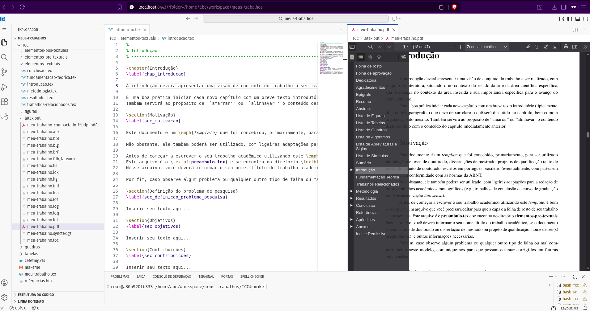
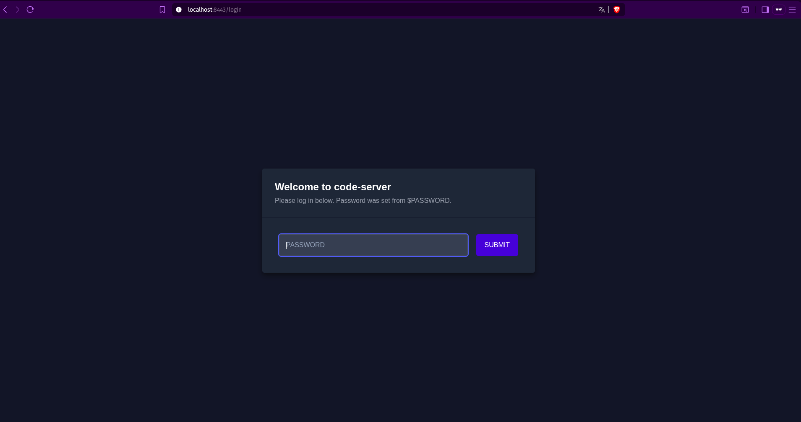

# 📚 Modelo LaTeX ABNT para TCC com Code-Server



Este repositório fornece um ambiente completo para escrever trabalhos acadêmicos em LaTeX seguindo as normas da ABNT.  
O diferencial é que todo o ambiente já vem pronto para rodar em contêiner (via Podman ou Docker), com **Code-Server** acessível pelo navegador e suporte ao pacote **abnTeX2**.

---

## 🔎 Histórico e Base

Este projeto foi inspirado e adaptado a partir de outros trabalhos:

- [eduardovitor/latex-modelos-abnt-ifal](https://github.com/eduardovitor/latex-modelos-abnt-ifal)  
- Que por sua vez teve como base [cfgnunes/latex-cefetmg](https://github.com/cfgnunes/latex-cefetmg)

O diferencial aqui é que além de fornecer os modelos LaTeX, o repositório já traz um **ambiente containerizado** com editor online (Code-Server), extensões e pacotes LaTeX instalados.

---

## 📦 Instalação dos pacotes LaTeX

Embora exista o [CTAN](https://ctan.org/) como repositório oficial de pacotes LaTeX, neste projeto optamos por instalar via **APT** (gerenciador de pacotes do Debian/Ubuntu).  
Isso garante simplicidade e compatibilidade com ambientes containerizados.

Pacotes instalados via `apt-get` incluem:

- `texlive` (base do LaTeX)
- `texlive-lang-portuguese` (suporte ao português)
- `texlive-latex-extra`, `texlive-fonts-extra`, `texlive-publishers`, `texlive-science`, `texlive-xetex`
- `latexmk` (automatizador de compilação)

---

## 🐳 Ambiente Containerizado

O ambiente é construído a partir de `debian:bookworm-slim` e inclui:

- **Code-Server**: VS Code rodando no navegador
- Extensão para visualização de PDF (`mathematic.vscode-pdf`)
- Pacotes LaTeX já configurados
- Suporte tanto para **Podman** quanto para **Docker**

---

## ⚙️ Script de Gerenciamento (`bash.sh`)

O script `bash.sh` facilita o uso do ambiente. Ele detecta automaticamente se você tem **Podman** ou **Docker** instalado, mas também permite escolher explicitamente:

```bash
./bash.sh build podman
./bash.sh build docker
```

### Comandos disponíveis

- `build` → constrói a imagem (`--squash` aplicado para reduzir camadas).  
  Após o build, remove automaticamente apenas as imagens `<none>` criadas no processo.  
- `up` → sobe o contêiner em segundo plano.  
- `down` → derruba o contêiner.  
- `logs` → mostra os logs em tempo real.  
- `exec` → abre um terminal dentro do contêiner.  
- `restart` → reinicia o contêiner.  
- `clean` → remove manualmente apenas as imagens `<none>` relacionadas ao projeto.  

O script também gerencia automaticamente o arquivo `.env` com variáveis como senha do Code-Server, UID e GID do usuário.

---

## 🚀 Como executar

1. **Clonar o repositório**
   ```bash
   git clone https://github.com/seuusuario/seurepo.git
   cd seurepo
   ```

2. **Construir a imagem**
   ```bash
   ./bash.sh build
   ```
   > Por padrão, o script detecta se você tem Podman ou Docker.  
   > Se quiser escolher explicitamente:  
   > `./bash.sh build podman` ou `./bash.sh build docker`

3. **Subir o contêiner**
   ```bash
   ./bash.sh up
   ```

4. **Acessar o Code-Server**
   - Abra o navegador em: [http://localhost:8443](http://localhost:8443)
   - Use a senha definida no `.env` (padrão inicial: `admin123`)

5. **Editar seu TCC**
   - O diretório de trabalho padrão é `/home/abc/workspace/meus-trabalhos`
   - Compile com `latexmk` ou diretamente pelo Code-Server

6. **Finalizar**
   ```bash
   ./bash.sh down
   ```

7. **Limpar imagens `<none>` manualmente (opcional)**
   ```bash
   ./bash.sh clean
   ```

---

## ✨ Diferenciais

- Ambiente pronto para uso, sem necessidade de configurar LaTeX manualmente.  
- Compatível com **Podman** e **Docker**.  
- Usa `--squash` para gerar imagens mais limpas e leves.  
- Script `bash.sh` automatiza criação de `.env`, permissões e execução.  
- Comando `clean` para remover apenas imagens `<none>` do projeto.  
- Baseado em projetos anteriores, mas com foco em **containerização moderna**.

---



---

## 📄 Licença

Este projeto segue a mesma filosofia dos repositórios que o inspiraram: livre para uso acadêmico e pessoal.
